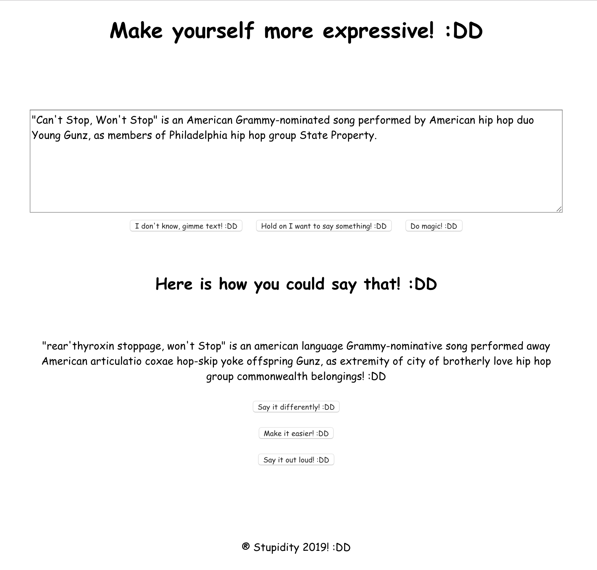

# Stupid App! :DD

    Have you ever wanted to say something, but weren't really sure which words to use? Fear not for there's a solution! :DD

A very useful application started at [Junction](https://www.hackjunction.com/) Stupid Hack 2019 hackathon, and for some reason continued a bit afterwards as well! :DD

It's basically an app that lets you input text, reword it in very stupid ways, and even says it out loud for you, just so that you can be sure that you have found exactly the right words to convey your deepest thoughts! :DD

See [demo video](https://drive.google.com/open?id=1SxOWwzrTuR2BVUBlL5faPAdHNFf3Dkak) (no sound tho! :DD)

Also check out the [awesome backend](https://github.com/anttispitkanen/stupid-serverless) written in Serverless, AWS Lambdas and DynamoDB! :DD
